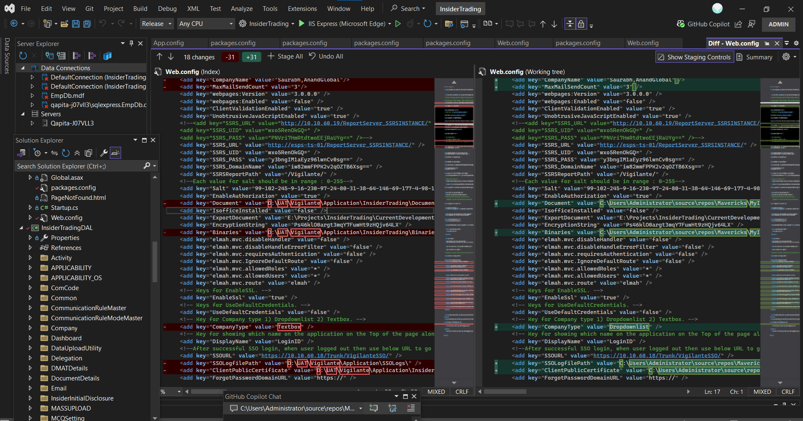

# Myinsider-Mavericks

- Started with cloning the azure devops repository which i was given access permissions inside Visual Studio.
- This project was using MVC+Entity Framework Tools and .NET framework 4.5(which will be present inside the windows OS, doesnt require any sdk specifically)
- Opened the project working directory inside the Visual Studio 2022 and started running process.
- Changed directory to C:\Users\Administrator\source\repos\Mavericks\MyInsider\Application that contained:
```bash
MyInsider\Application
  -DataUploadUtility
  -FileEncryptDecrypt
  -InsiderTrading
  -InsiderTradingDAL
  -InsiderTradingEncryption
  -INSIDERTRADINGEXCELWRITER
  -INSIDERTRADINGMASSUPLOAD
  -InsiderTradingSSO
  -RestrictedListCRM
  -InsiderTrading.sln
```
- First directly clicked restore all packages and update command inside visual studio's package manager, which caused many git changes so I deleted and removed everything.
- Cloned and opened again, installed nuget CLI to use it for installing same exact configuration of package.json available in above given directory folders.
- Redirected and opened each directory which ever is having package.json and installed them using nuget.
- When cloned packages.json was only present in maybe 3 folders inside Application folder and after this process each of them contained updated exact required packages.json.
- So i now i tried to build the main InsiderTrading folder but got below error:
```markdown
Path
C:\Users\Administrator\Source\Repos\Mavericks\MyInsider\Application\InsiderTrading
PM> dotnet clean Build started 3/28/2025 10:52:33 AM. 1>Project "C:\Users\Administrator\Source\Repos\Mavericks\MyInsider\Application\InsiderTrading\InsiderTrading.csproj" on node 1 (Clean target(s)). 1>C:\Users\Administrator\Source\Repos\Mavericks\MyInsider\Application\InsiderTrading\InsiderTrading.csproj(3319,3): error MSB4019: The imported project "C:\Program Files\dotnet\sdk\9.0.201\Microsoft\VisualStudio\v17.0\WebApplications\Microsoft.WebApplication.targets" was not found. Confirm that the expression in the Import declaration "$(VSToolsPath)\WebApplications\Microsoft.WebApplication.targets", which evaluated to "C:\Program Files\dotnet\sdk\9.0.201\Microsoft\VisualStudio\v17.0\WebApplications\Microsoft.WebApplication.targets", is correct, and that the file exists on disk. 1>Done Building Project "C:\Users\Administrator\Source\Repos\Mavericks\MyInsider\Application\InsiderTrading\InsiderTrading.csproj" (Clean target(s)) -- FAILED.
Build FAILED.
   "C:\Users\Administrator\Source\Repos\Mavericks\MyInsider\Application\InsiderTrading\InsiderTrading.csproj" (Clean target) (1) ->
     C:\Users\Administrator\Source\Repos\Mavericks\MyInsider\Application\InsiderTrading\InsiderTrading.csproj(3319,3): error MSB4019: The imported project "C:\Program Files\dotnet\sdk\9.0.201\Microsoft\VisualStudio\v17.0\WebApplications\Microsoft.WebApplication.targets" was not found. Confirm that the expression in the Import declaration "$(VSToolsPath)\WebApplications\Microsoft.WebApplication.targets", which evaluated to "C:\Program Files\dotnet\sdk\9.0.201\Microsoft\VisualStudio\v17.0\WebApplications\Microsoft.WebApplication.targets", is correct, and that the file exists on disk.

0 Warning(s)
1 Error(s)
Time Elapsed 00:00:00.11
```
The error message indicates that the project file InsiderTrading.csproj is trying to import a target file Microsoft.WebApplication.targets from a path that does not exist. This is likely because the project is targeting the .NET Framework and is being built using the .NET SDK, which does not include the necessary targets for web applications.
To resolve this issue, you should build the project using MSBuild from the Visual Studio Developer Command Prompt instead of using dotnet CLI. Here are the steps:
1.	Open the Developer Command Prompt for Visual Studio. You can find it in the Start menu under Visual Studio.
2.	Navigate to the project directory:  cd C:\Users\Administrator\Source\Repos\Mavericks\MyInsider\Application\InsiderTrading
3.	Clean the project using MSBuild:   msbuild /t:Build
4.	Build the project using MSBuild:   msbuild /t:Build
5.	Next we need to run using msbuild /t:Run. 

- Even after doing above it resulted in 284 Warnings and 78 errors
- C:\Users\Administrator\Source\Repos\Mavericks\MyInsider\Application\INSIDERTRADINGEXCELWRITER\ExcelWriter\CommonOpenXML.cs
- This was mainly due to some verison changing of DocumentFormat.OpenXml, the one that installed was a latest 3.3 version but our project was built using an older version 2.5, so i downgraded it buy uninsatlling latest and installing 2.5 version. Thought this would resolve the issue but got that two are present inside the same and both are being utilised
  
```bash
The type 'UInt32Value' exists in both 'DocumentFormat.OpenXml.Framework, Version=3.3.0.0, Culture=neutral, PublicKeyToken=8fb06cb64d019a17' and 'DocumentFormat.OpenXml, Version=2.5.5631.0, Culture=neutral, PublicKeyToken=31bf3856ad364e35'
```
this was inside packages.config: 
<?xml version="1.0" encoding="utf-8"?> 
  <packages> 
    <package id="DocumentFormat.OpenXml" version="2.5" targetFramework="net48"  /> 
    <package id="DocumentFormat.OpenXml" version="3.3" targetFramework="net46"  />
  </packages>

removed that 3.3 one and still the issue wasn't resolved.
To eradicate it we need to go into each folder .csproj file and remove latest version and make sure only old one is present-
```bash
<ItemGroup>
    <Reference Include="DocumentFormat.OpenXml, Version=2.5.5631.0, Culture=neutral, PublicKeyToken=31bf3856ad364e35, processorArchitecture=MSIL">
      <HintPath>..\packages\DocumentFormat.OpenXml.2.5\lib\DocumentFormat.OpenXml.dll</HintPath>
    </Reference>
</ItemGroup>
```
- Now if i clean and build the errors got reduced to 1, which indicated i need to clean+build a folder other than InsiderTrading that is responsible for error.
- Then again i tried to run the solution using msbuild but again build got failed.
- Next i did Cleaning+Building of each project folder using the Visual studio interface, got zero errors and many warnings. So I run the solution using the Run button present inside interface.
 
---

## 🛠️ SSMS Restore Options Explained

---

### ✅ **1. Overwrite the existing database (WITH REPLACE)**

- **Checkbox label:** `✓ Overwrite the existing database (WITH REPLACE)`
- **T-SQL equivalent:** `WITH REPLACE`

**What it does:**
- Forces the restore to overwrite the existing database **even if the backup is from a different database or has a different DB ID**.
- Useful when you're restoring a backup over a broken or different version of the same DB.

**When to use:**
- The database already exists and you want to fully replace it.
- You're restoring a DB with a different name or origin (like from prod to dev).

> ⚠️ Use with care — this replaces the current DB completely.

---

### 🔄 **2. Preserve the replication settings (WITH KEEP_REPLICATION)**

- **Checkbox label:** `✓ Preserve the replication settings (WITH KEEP_REPLICATION)`
- **T-SQL equivalent:** `WITH KEEP_REPLICATION`

**What it does:**
- Keeps the replication settings intact if the database is part of **SQL Server replication**.

**When to use:**
- You are restoring a **replicated database** and want to maintain replication roles and metadata.

---

### 🔐 **3. Restrict access to the restored database (WITH RESTRICTED_USER)**

- **Checkbox label:** `✓ Restrict access to the restored database (WITH RESTRICTED_USER)`
- **T-SQL equivalent:** `WITH RESTRICTED_USER`

**What it does:**
- After restore, the database will only be accessible by users with `db_owner`, `dbcreator`, or `sysadmin` roles.

**When to use:**
- You want to limit access immediately after restore for verification or admin tasks.

---

### 🔁 **4. Recovery State**

You’ll see 3 radio buttons under **Recovery State**, which map to how SQL Server handles the recovery phase:

#### a. ✅ **RESTORE WITH RECOVERY** (default)
- **What it does:** Finalizes the restore and makes the database ready for use.
- **When to use:** If you're restoring the **last or only backup**, and you're done restoring.

#### b. 🚫 **RESTORE WITH NORECOVERY**
- **What it does:** Puts the database in a **restoring state**, allowing **additional backups** to be applied (like diff or log backups).
- **When to use:** If you plan to **restore more than one backup**, like a full + diff + logs.

> You must use `WITH RECOVERY` at the end to make the DB usable.

#### c. 🔒 **RESTORE WITH STANDBY**
- **What it does:** Leaves the database **read-only** and **restores the transaction log undo file**, allowing for additional restores later.
- **When to use:** If you're doing **log shipping** or need to inspect the DB between log restores.

---

### 🔄 **5. Close existing connections to destination database**

- **Checkbox label:** `✓ Close existing connections to destination database`
- **GUI-only option**
- **T-SQL workaround:** Use `ALTER DATABASE ... SET SINGLE_USER WITH ROLLBACK IMMEDIATE`

**What it does:**
- Disconnects all users and sessions from the destination DB before restoring.
- Helps avoid the “exclusive access” error you saw earlier.

**When to use:**
- Always good to enable this if you’re restoring over an existing DB that might be in use.

---

## 🧪 Example T-SQL Mapping:

Here’s what all those options might look like in T-SQL:

```sql
RESTORE DATABASE UPSIQA_V8_1
FROM DISK = 'C:\Backups\UPSIQA_V8_1.bak'
WITH 
    MOVE 'UPSIQA_V8_1_Data' TO 'C:\SQLData\UPSIQA_V8_1.mdf',
    MOVE 'UPSIQA_V8_1_Log' TO 'C:\SQLData\UPSIQA_V8_1_log.ldf',
    REPLACE,
    RECOVERY,
    STATS = 10;
```

---
- Now that we receiving the connection sql error, so i had to restore the Vigilante_master DB and encrypted connection string with MD5 and replaced it in web.config file.
- So now finally the UI was running after this. But i had to create few empty folders and change the some paths as of below image
  
- Also restore Myinsider_blank DB with required name.
- We need to update two tables each from our databases:
 1. In Vigilante_Master, run below sql query in SSMS:
```sql
SELECT * FROM COMPANIES

UPDATE Companies
SET 
    ConnectionServer = 'QAP-7J0VLL3\SQLEXPRESS',
    CompanyName='Demo',
    ConnectionDatabaseName = 'MyInsider_demo', (name of newly restored Myinsider_blank DB as renamed)
    ConnectionUsername = 'your_user',
    ConnectionPassword = 'your-pass'
WHERE CompanyID = '1';
```
Now we were able to see the Company name field auto selected as 'demo'.
 2. But we were unable to login as i was getting invalid username or password, so i tried to reset/update the password in Myinsider_demo's table dbo.usr_Authentication as:
 ```sql
select * from usr_Authentication

UPDATE usr_Authentication
SET password='some-other-hashed-password'
WHERE UserInfoID='1';
```
Still unable to login successfully so i've reset the SaltValue to NULL
```sql
UPDATE usr_Authentication
SET SaltValue='NULL';
```
- This time got captcha and we have reset with new password and were able to login successfully !!

#### IIS Deployement

- Now we need to deploy the application.
- Open project solution in Visual Studio and click on publish, this will create at "C:\Users\Administrator\source\repos\Mavericks\MyInsider\Application\InsiderTrading\bin\app.publish".
- Create a new folder as myinsider at "C:\inetpub\myinsider".Copy the previous app.publish folder content and paste here.
- Open IIS and click add a new site and give your name and select the physical directory as "C:\inetpub\myinsider", add port number like 8084.
- When opened the localhost:8084, i was getting:
```markdown
Server Error in '/' Application.
Configuration Error
Description: An error occurred during the processing of a configuration file required to service this request. Please review the specific error details below and modify your configuration file appropriately.

Parser Error Message: Could not load file or assembly 'DocumentFormat.OpenXml' or one of its dependencies. This assembly is built by a runtime newer than the currently loaded runtime and cannot be loaded.

Source Error:


Line 57:                 <add assembly="System.EnterpriseServices, Version=2.0.0.0, Culture=neutral, PublicKeyToken=b03f5f7f11d50a3a"/>
Line 58:                 <add assembly="System.Web.Mobile, Version=2.0.0.0, Culture=neutral, PublicKeyToken=b03f5f7f11d50a3a"/>
Line 59:                 <add assembly="*"/>
Line 60:                 <add assembly="System.Runtime.Serialization, Version=3.0.0.0, Culture=neutral, PublicKeyToken=b77a5c561934e089, processorArchitecture=MSIL"/>
Line 61:                 <add assembly="System.IdentityModel, Version=3.0.0.0, Culture=neutral, PublicKeyToken=b77a5c561934e089, processorArchitecture=MSIL"/>

Source File: C:\Windows\Microsoft.NET\Framework64\v2.0.50727\Config\web.config    Line: 59

Assembly Load Trace: The following information can be helpful to determine why the assembly 'DocumentFormat.OpenXml' could not be loaded.


WRN: Assembly binding logging is turned OFF.
To enable assembly bind failure logging, set the registry value [HKLM\Software\Microsoft\Fusion!EnableLog] (DWORD) to 1.
Note: There is some performance penalty associated with assembly bind failure logging.
To turn this feature off, remove the registry value [HKLM\Software\Microsoft\Fusion!EnableLog].

Version Information: Microsoft .NET Framework Version:2.0.50727.9179; ASP.NET Version:2.0.50727.9175
```
To resolve:
- Check the .NET Framework version: The error message suggests that the server is using .NET Framework version 2.0 (v2.0.50727). However, the DocumentFormat.OpenXml library might require a higher version, such as .NET Framework 4.x, which is used in your application.

- Ensure your IIS application pool is configured to use the correct version of the .NET Framework (4.x) rather than 2.0.

- You can check the app pool settings in IIS:

> Open IIS Manager.

> Select the Application Pool being used by your application.

> In the right pane, click on Basic Settings.

> Ensure the .NET Framework version is set to v4.x (like .NET Framework v4.0 or higher).

- Check the web.config file's compilation tag:

- Since you're targeting .NET 4.x, make sure the compilation element in your web.config file has the correct targetFramework:

```xml
<compilation debug="true" targetFramework="4.5">
```
Check for assembly binding issues in web.config:

- It's possible that the application is trying to use assemblies designed for .NET 4.x (like DocumentFormat.OpenXml), but due to mismatched configurations or binding redirects, it's trying to load them with .NET 2.0. You may need to add or modify binding redirects in the web.config for this assembly to ensure it loads the correct version.


```xml

<runtime>
  <assemblyBinding xmlns="urn:schemas-microsoft-com:asm.v1">
    <dependentAssembly>
      <assemblyIdentity name="DocumentFormat.OpenXml" publicKeyToken="31bf3856ad364e35" culture="neutral"/>
      <bindingRedirect oldVersion="0.0.0.0-2.0.0.0" newVersion="2.0.0.0"/>
    </dependentAssembly>
  </assemblyBinding>
</runtime>
```

Now i was getting:
```markdown
Server Error in '/' Application.
Access to the path 'C:\inetpub\myinsider\DebugLogs\VigilateLog_31March2025.txt' is denied.
Description: An unhandled exception occurred during the execution of the current web request. Please review the stack trace for more information about the error and where it originated in the code.

Exception Details: System.UnauthorizedAccessException: Access to the path 'C:\inetpub\myinsider\DebugLogs\VigilateLog_31March2025.txt' is denied.

ASP.NET is not authorized to access the requested resource. Consider granting access rights to the resource to the ASP.NET request identity. ASP.NET has a base process identity (typically {MACHINE}\ASPNET on IIS 5 or Network Service on IIS 6 and IIS 7, and the configured application pool identity on IIS 7.5) that is used if the application is not impersonating. If the application is impersonating via <identity impersonate="true"/>, the identity will be the anonymous user (typically IUSR_MACHINENAME) or the authenticated request user.

To grant ASP.NET access to a file, right-click the file in File Explorer, choose "Properties" and select the Security tab. Click "Add" to add the appropriate user or group. Highlight the ASP.NET account, and check the boxes for the desired access.

Source Error:

An unhandled exception was generated during the execution of the current web request. Information regarding the origin and location of the exception can be identified using the exception stack trace below.

Stack Trace:


[UnauthorizedAccessException: Access to the path 'C:\inetpub\myinsider\DebugLogs\VigilateLog_31March2025.txt' is denied.]
   InsiderTrading.Common.Common.WriteLogToFile(String sLogMessage, MethodBase objCurrentMethod, Exception ObjException, Boolean checkdebug) +1208
   InsiderTrading.Common.Common.getSystemConnectionString() +83
   InsiderTrading.MvcApplication.Application_Start() +578

[HttpException (0x80004005): Access to the path 'C:\inetpub\myinsider\DebugLogs\VigilateLog_31March2025.txt' is denied.]
   System.Web.HttpApplicationFactory.EnsureAppStartCalledForIntegratedMode(HttpContext context, HttpApplication app) +546
   System.Web.HttpApplication.RegisterEventSubscriptionsWithIIS(IntPtr appContext, HttpContext context, MethodInfo[] handlers) +171
   System.Web.HttpApplication.InitSpecial(HttpApplicationState state, MethodInfo[] handlers, IntPtr appContext, HttpContext context) +173
   System.Web.HttpApplicationFactory.GetSpecialApplicationInstance(IntPtr appContext, HttpContext context) +255
   System.Web.Hosting.PipelineRuntime.InitializeApplication(IntPtr appContext) +347

[HttpException (0x80004005): Access to the path 'C:\inetpub\myinsider\DebugLogs\VigilateLog_31March2025.txt' is denied.]
   System.Web.HttpRuntime.FirstRequestInit(HttpContext context) +552
   System.Web.HttpRuntime.EnsureFirstRequestInit(HttpContext context) +122
   System.Web.HttpRuntime.ProcessRequestNotificationPrivate(IIS7WorkerRequest wr, HttpContext context) +732

Version Information: Microsoft .NET Framework Version:4.0.30319; ASP.NET Version:4.8.9282.0
```
Final:
- Created DebugLogs folder inside "C:\inetpub\myinsider".
- Clicked the DebugLogs folder properties -> security -> gave full control for CREATOR OWNER, SYSTEM, Adminstartors, Users.
- Restart IIS and everything works perfect

